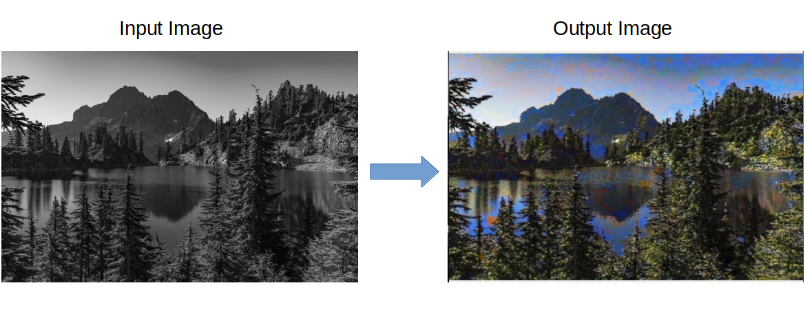

# Image Recolorizer
CNN implementation to automatically color a black and white image.

# Installing Dependencies
```
pip install -U pip
pip install -r requirements.txt
```

# Usage
`python colorize.py <image_name.jpg>`

# Demo


